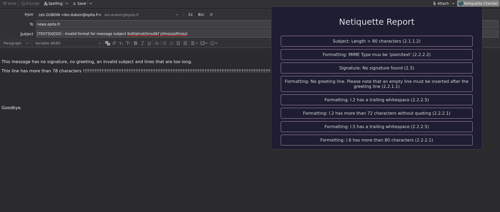

# Netiquette

A thunderbird extension for EPITA students that checks if a draft follows the netiquette.

## How to install

This add-on is available [here](https://addons.thunderbird.net/en-US/thunderbird/addon/epita-netiquette-checker/).

### Manually

1. Clone this repository
2. Go to thunderbird > Settings > Add ons
3. Select `Debug Add-Ons` > `Load Temporary Add-On`
4. Load this project's `manifest.json`

## Contributing

If you spot any error, false positives or not treated rules, please open an issue or submit a merge request.

I'm not going to refine the UI, so if you feel like doing so, please go ahead :^)
